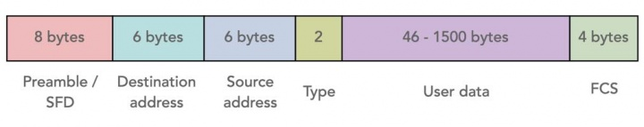
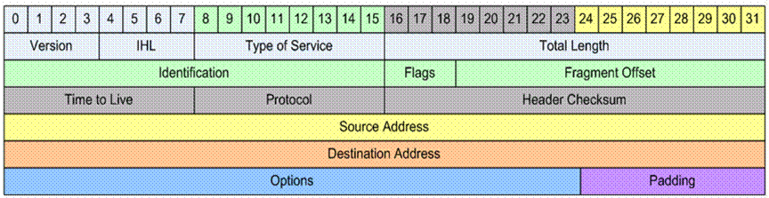

# Redes 2

    sudo phython3 sniffer.py
    
## Sniffers

 Ultilizados para monitorar o trafico de internet podendo interceptar todos os pacotes que passam por ela

## Cabeçalho Ethernet

Ultilizando um unico meio de acesso compartilhado por todos os computadores de uma rede, a Etherner é a tecnologia mais difundida na criação de LANs (Local Area Network). Dessa forma uma transmissão nesse meio se propaga para todos os computadores da rede. Essa forma de transmissão é denominada <b> Broadcast </b>

As transmissões da tecnologia Ethernet são feitas atravez de mensagens estruturadas chamadas quadros ou frames. Esse quadro traz os endereços de origem, quem deve ler a mensagem, e destino, quem enviou a mensagem, da transmissão. Como todos os computadores recebem todas as mensagens enviadas é feita a comparação do endereço de destino com o endereço próprio da máquina, afim de processar ou não a mensagem.

O Sniffer funcionará então captando todos esses pacotes que trafegam pela rede e tratando os dados para a identifição dos dados, além de humanizar a leitura destes.

### REDE
* Protocolo IP

### TRANSPORTE -> Protocolos
* TCP

* UDP
* ICMP

<footer>
    sniffer.v1
</footer>
